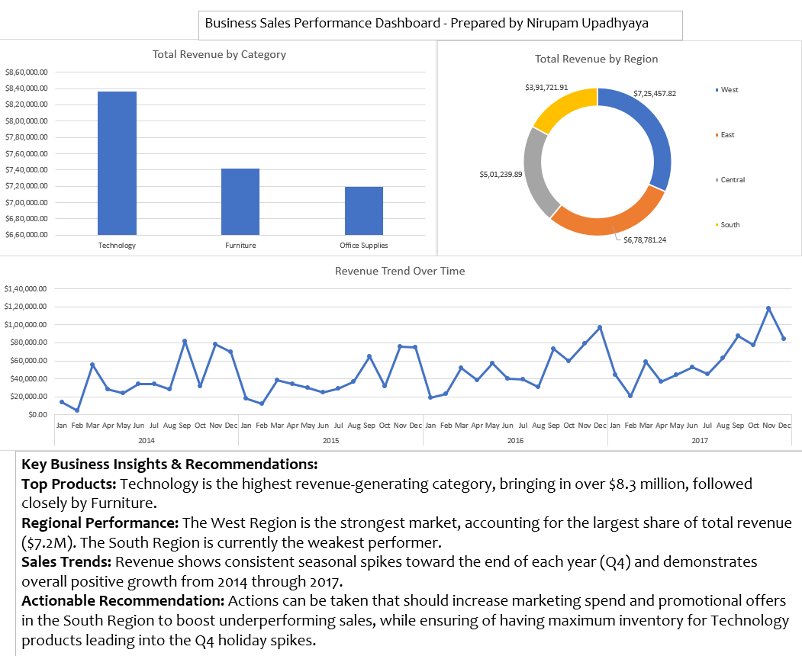

# Business Sales Performance Analytics - Task 1

## 📊 Project Overview
This project is part of the Data Science & Analytics Internship at Future Interns. The objective of this task is to analyze raw business sales data to identify revenue trends, top-selling product categories, and regional performance, culminating in a client-ready visual dashboard.

## 📁 Dataset
* **Source:** Superstore Sales Dataset
* **Domain:** Retail/E-commerce Sales

## 🛠️ Tools Used
* **Microsoft Excel:** Data cleaning, Pivot Tables, Data Visualization, and Dashboard design.

## 🖼️ Dashboard Preview

## 💡 Key Business Insights & Recommendations
* **Top Products:** Technology is the highest revenue-generating category, bringing in over $8.3 million, followed closely by Furniture. 
* **Regional Performance:** The West Region is the strongest market, accounting for the largest share of total revenue ($7.2M). The South Region is currently the weakest performer.
* **Sales Trends:** Revenue shows consistent seasonal spikes toward the end of each year (Q4) and demonstrates overall positive growth from 2014 through 2017.
* **Actionable Recommendation:** Increase marketing spend and promotional offers in the South Region to boost underperforming sales, while ensuring maximum inventory for Technology products leading into the Q4 holiday spikes.

---
*Prepared by Nirupam Upadhyaya*
